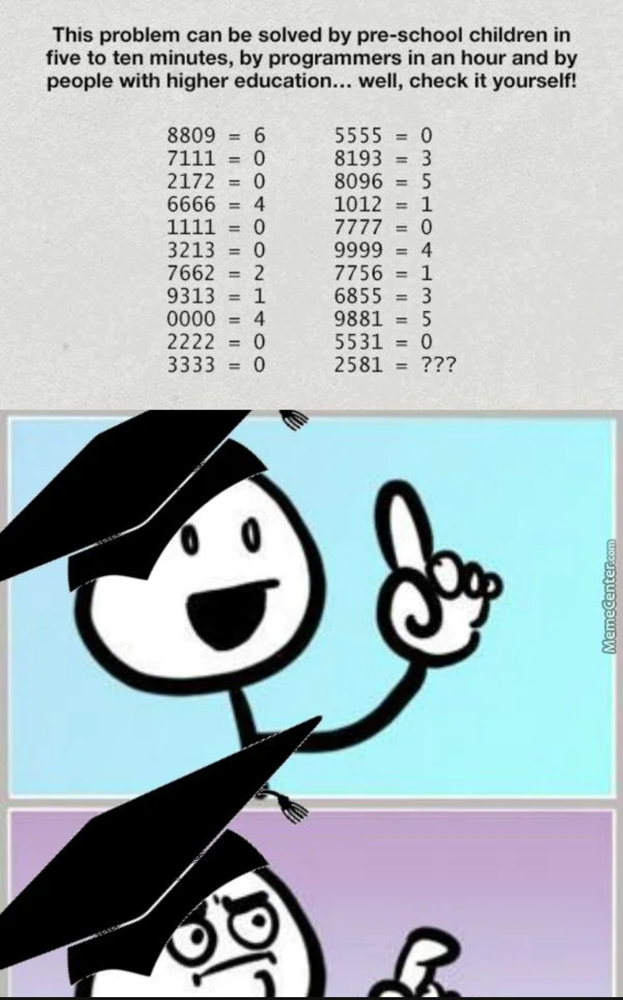

# digit-loops

## Description

Rust library for finding out how many loops there are in a given string of digits

Inspired by this puzzle found somewhere on Facebook:  

<p align="center">
  
</p>

## Usage

```rust
use digit_loops;

digit_loops::number_of_loops_in_number("8888");
// => 8
```
